# Package: opentelemetry.proto.metrics.v1

Copyright 2019, OpenTelemetry Authors Licensed under the Apache License, Version 2.0 (the "License"); you may not use this file except in compliance with the License. You may obtain a copy of the License at http://www.apache.org/licenses/LICENSE-2.0 Unless required by applicable law or agreed to in writing, software distributed under the License is distributed on an "AS IS" BASIS, WITHOUT WARRANTIES OR CONDITIONS OF ANY KIND, either express or implied. See the License for the specific language governing permissions and limitations under the License. 

## Imports

| Import                                         | Description |
|------------------------------------------------|-------------|
| opentelemetry/proto/common/v1/common.proto     |             |
| opentelemetry/proto/resource/v1/resource.proto |             |

## Options

| Name                 | Value                                     | Description |
|----------------------|-------------------------------------------|-------------|
| csharp_namespace     | OpenTelemetry.Proto.Metrics.V1            |             |
| java_multiple_files  | true                                      |             |
| java_package         | io.opentelemetry.proto.metrics.v1         |             |
| java_outer_classname | MetricsProto                              |             |
| go_package           | go.opentelemetry.io/proto/otlp/metrics/v1 |             |

## Enum: AggregationTemporality

FQN: opentelemetry.proto.metrics.v1.AggregationTemporality

AggregationTemporality defines how a metric aggregator reports aggregated values. It describes how those values relate to the time interval over which they are aggregated. 

| Name                                | Ordinal | Description                                                                                                                                                                                                                                                                                                                                                                                                                                                                                                                                                                                                                                                                                                                                                                                                                                                                                                                                                                                                                                                                                                                                                                                                                                                                                                                                                                                                                                                                                                                                                                                                                                                                                                                                                                                                                                                                                                 |
|-------------------------------------|---------|-------------------------------------------------------------------------------------------------------------------------------------------------------------------------------------------------------------------------------------------------------------------------------------------------------------------------------------------------------------------------------------------------------------------------------------------------------------------------------------------------------------------------------------------------------------------------------------------------------------------------------------------------------------------------------------------------------------------------------------------------------------------------------------------------------------------------------------------------------------------------------------------------------------------------------------------------------------------------------------------------------------------------------------------------------------------------------------------------------------------------------------------------------------------------------------------------------------------------------------------------------------------------------------------------------------------------------------------------------------------------------------------------------------------------------------------------------------------------------------------------------------------------------------------------------------------------------------------------------------------------------------------------------------------------------------------------------------------------------------------------------------------------------------------------------------------------------------------------------------------------------------------------------------|
| AGGREGATION_TEMPORALITY_UNSPECIFIED | 0       | UNSPECIFIED is the default AggregationTemporality, it MUST not be used.                                                                                                                                                                                                                                                                                                                                                                                                                                                                                                                                                                                                                                                                                                                                                                                                                                                                                                                                                                                                                                                                                                                                                                                                                                                                                                                                                                                                                                                                                                                                                                                                                                                                                                                                                                                                                                     |
| AGGREGATION_TEMPORALITY_DELTA       | 1       | DELTA is an AggregationTemporality for a metric aggregator which reports changes since last report time. Successive metrics contain aggregation of values from continuous and non-overlapping intervals. The values for a DELTA metric are based only on the time interval associated with one measurement cycle. There is no dependency on previous measurements like is the case for CUMULATIVE metrics. For example, consider a system measuring the number of requests that it receives and reports the sum of these requests every second as a DELTA metric: 1. The system starts receiving at time=t_0. 2. A request is received, the system measures 1 request. 3. A request is received, the system measures 1 request. 4. A request is received, the system measures 1 request. 5. The 1 second collection cycle ends. A metric is exported for the number of requests received over the interval of time t_0 to t_0+1 with a value of 3. 6. A request is received, the system measures 1 request. 7. A request is received, the system measures 1 request. 8. The 1 second collection cycle ends. A metric is exported for the number of requests received over the interval of time t_0+1 to t_0+2 with a value of 2.                                                                                                                                                                                                                                                                                                                                                                                                                                                                                                                                                                                                                                                                            |
| AGGREGATION_TEMPORALITY_CUMULATIVE  | 2       | CUMULATIVE is an AggregationTemporality for a metric aggregator which reports changes since a fixed start time. This means that current values of a CUMULATIVE metric depend on all previous measurements since the start time. Because of this, the sender is required to retain this state in some form. If this state is lost or invalidated, the CUMULATIVE metric values MUST be reset and a new fixed start time following the last reported measurement time sent MUST be used. For example, consider a system measuring the number of requests that it receives and reports the sum of these requests every second as a CUMULATIVE metric: 1. The system starts receiving at time=t_0. 2. A request is received, the system measures 1 request. 3. A request is received, the system measures 1 request. 4. A request is received, the system measures 1 request. 5. The 1 second collection cycle ends. A metric is exported for the number of requests received over the interval of time t_0 to t_0+1 with a value of 3. 6. A request is received, the system measures 1 request. 7. A request is received, the system measures 1 request. 8. The 1 second collection cycle ends. A metric is exported for the number of requests received over the interval of time t_0 to t_0+2 with a value of 5. 9. The system experiences a fault and loses state. 10. The system recovers and resumes receiving at time=t_1. 11. A request is received, the system measures 1 request. 12. The 1 second collection cycle ends. A metric is exported for the number of requests received over the interval of time t_1 to t_0+1 with a value of 1. Note: Even though, when reporting changes since last report time, using CUMULATIVE is valid, it is not recommended. This may cause problems for systems that do not use start_time to determine when the aggregation value was reset (e.g. Prometheus).  |

## Enum: DataPointFlags

FQN: opentelemetry.proto.metrics.v1.DataPointFlags

DataPointFlags is defined as a protobuf 'uint32' type and is to be used as a bit-field representing 32 distinct boolean flags. Each flag defined in this enum is a bit-mask. To test the presence of a single flag in the flags of a data point, for example, use an expression like: (point.flags & DATA_POINT_FLAGS_NO_RECORDED_VALUE_MASK) == DATA_POINT_FLAGS_NO_RECORDED_VALUE_MASK 

| Name                                    | Ordinal | Description                                                                                                                                                                              |
|-----------------------------------------|---------|------------------------------------------------------------------------------------------------------------------------------------------------------------------------------------------|
| DATA_POINT_FLAGS_DO_NOT_USE             | 0       | The zero value for the enum. Should not be used for comparisons. Instead use bitwise "and" with the appropriate mask as shown above.                                                     |
| DATA_POINT_FLAGS_NO_RECORDED_VALUE_MASK | 1       | This DataPoint is valid but has no recorded value. This value SHOULD be used to reflect explicitly missing data in a series, as for an equivalent to the Prometheus "staleness marker".  |

### AggregationTemporality Diagram

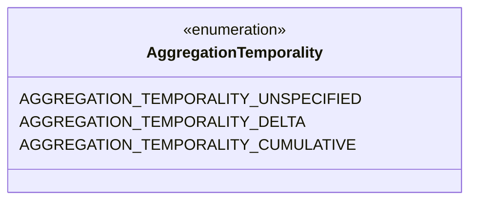
### DataPointFlags Diagram

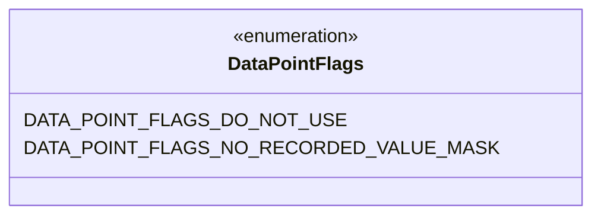
### MetricsData Diagram

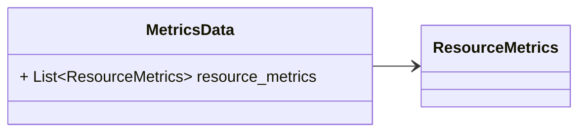
### ResourceMetrics Diagram

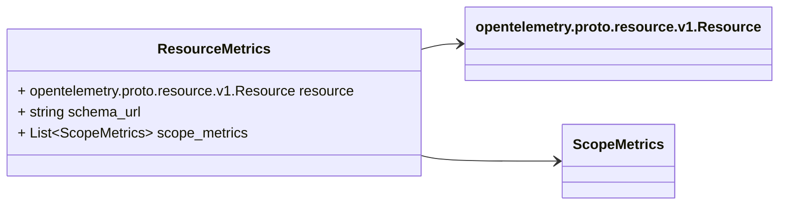
### ScopeMetrics Diagram

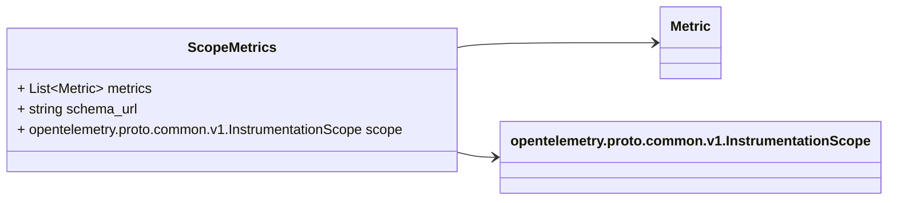
### Metric Diagram

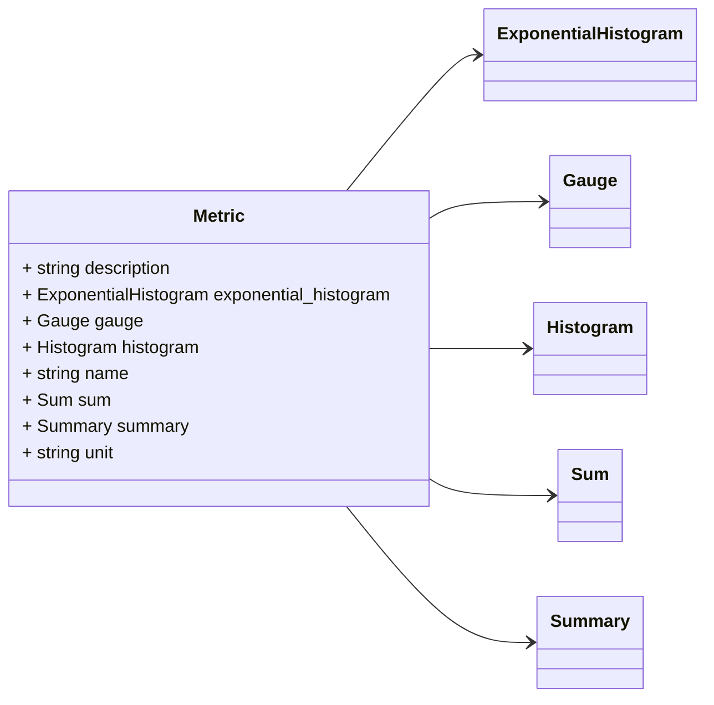
### Gauge Diagram

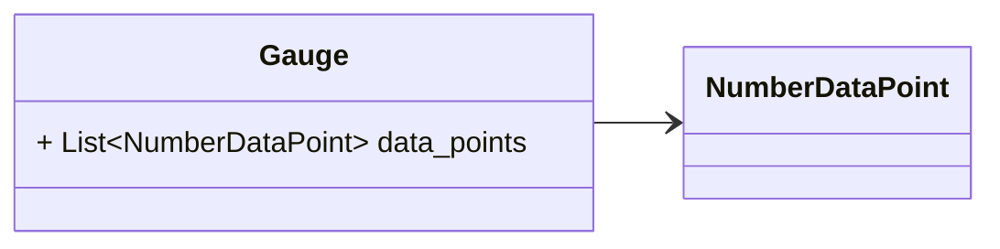
### Sum Diagram

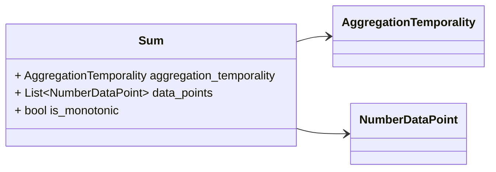
### Histogram Diagram

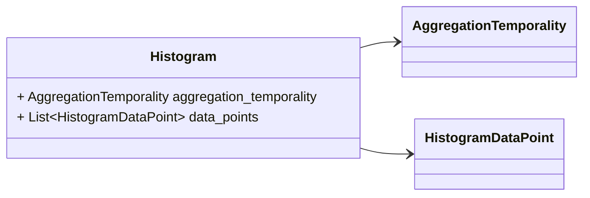
### ExponentialHistogram Diagram

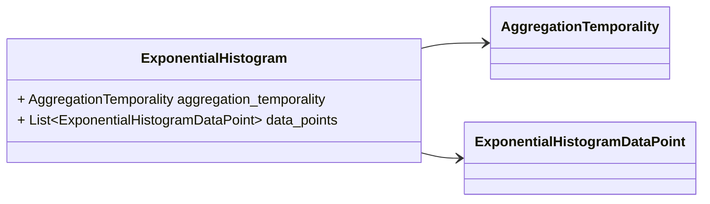
### Summary Diagram

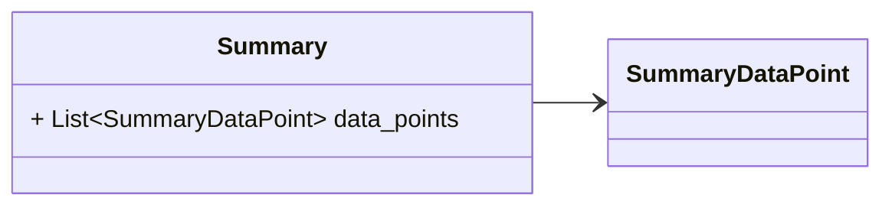
### NumberDataPoint Diagram

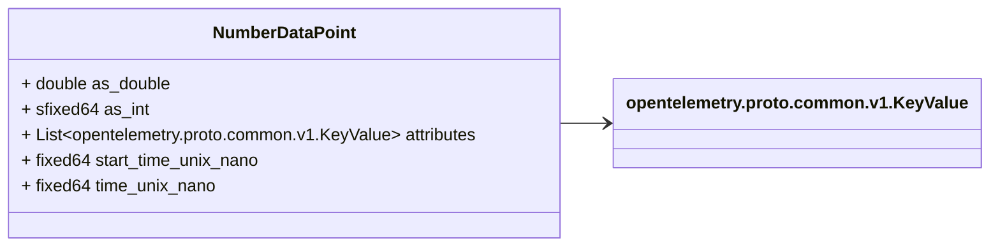
### HistogramDataPoint Diagram

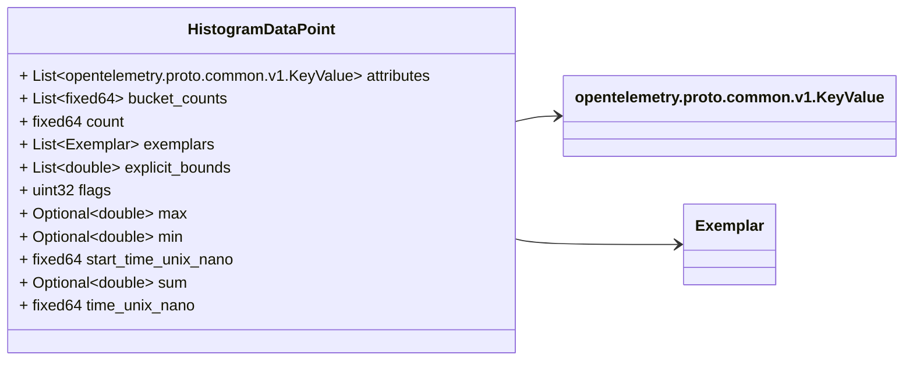
### ExponentialHistogramDataPoint Diagram

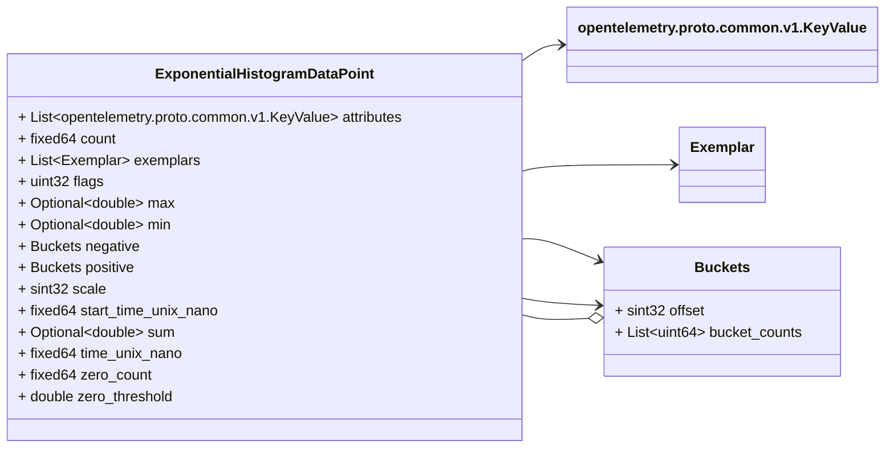
### SummaryDataPoint Diagram

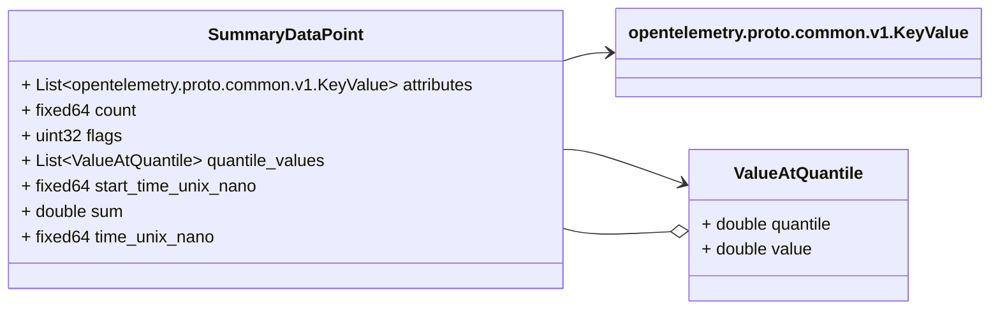
### Exemplar Diagram

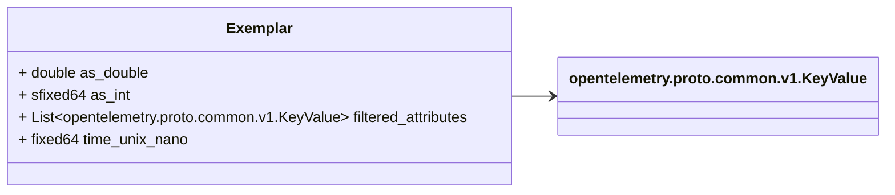

## Message: MetricsData

FQN: opentelemetry.proto.metrics.v1.MetricsData

MetricsData represents the metrics data that can be stored in a persistent storage, OR can be embedded by other protocols that transfer OTLP metrics data but do not implement the OTLP protocol. The main difference between this message and collector protocol is that in this message there will not be any "control" or "metadata" specific to OTLP protocol. When new fields are added into this message, the OTLP request MUST be updated as well. 

| Field            | Ordinal | Type            | Label    | Description                                                                                                                                                                                                                                                                                   |
|------------------|---------|-----------------|----------|-----------------------------------------------------------------------------------------------------------------------------------------------------------------------------------------------------------------------------------------------------------------------------------------------|
| resource_metrics | 1       | ResourceMetrics | Repeated | An array of ResourceMetrics. For data coming from a single resource this array will typically contain one element. Intermediary nodes that receive data from multiple origins typically batch the data before forwarding further and in that case this array will contain multiple elements.  |

## Message: ResourceMetrics

FQN: opentelemetry.proto.metrics.v1.ResourceMetrics

A collection of ScopeMetrics from a Resource. 

| Field         | Ordinal | Type                                     | Label    | Description                                                                                                                                                                                                                                                                                                                                                           |
|---------------|---------|------------------------------------------|----------|-----------------------------------------------------------------------------------------------------------------------------------------------------------------------------------------------------------------------------------------------------------------------------------------------------------------------------------------------------------------------|
| resource      | 1       | opentelemetry.proto.resource.v1.Resource |          | The resource for the metrics in this message. If this field is not set then no resource info is known.                                                                                                                                                                                                                                                                |
| schema_url    | 3       | string                                   |          | The Schema URL, if known. This is the identifier of the Schema that the resource data is recorded in. To learn more about Schema URL see https://opentelemetry.io/docs/specs/otel/schemas/#schema-url This schema_url applies to the data in the "resource" field. It does not apply to the data in the "scope_metrics" field which have their own schema_url field.  |
| scope_metrics | 2       | ScopeMetrics                             | Repeated | A list of metrics that originate from a resource.                                                                                                                                                                                                                                                                                                                     |

## Message: ScopeMetrics

FQN: opentelemetry.proto.metrics.v1.ScopeMetrics

A collection of Metrics produced by an Scope. 

| Field      | Ordinal | Type                                               | Label    | Description                                                                                                                                                                                                                                                         |
|------------|---------|----------------------------------------------------|----------|---------------------------------------------------------------------------------------------------------------------------------------------------------------------------------------------------------------------------------------------------------------------|
| metrics    | 2       | Metric                                             | Repeated | A list of metrics that originate from an instrumentation library.                                                                                                                                                                                                   |
| schema_url | 3       | string                                             |          | The Schema URL, if known. This is the identifier of the Schema that the metric data is recorded in. To learn more about Schema URL see https://opentelemetry.io/docs/specs/otel/schemas/#schema-url This schema_url applies to all metrics in the "metrics" field.  |
| scope      | 1       | opentelemetry.proto.common.v1.InstrumentationScope |          | The instrumentation scope information for the metrics in this message. Semantically when InstrumentationScope isn't set, it is equivalent with an empty instrumentation scope name (unknown).                                                                       |

## Message: Metric

FQN: opentelemetry.proto.metrics.v1.Metric

Defines a Metric which has one or more timeseries. The following is a brief summary of the Metric data model. For more details, see: https://github.com/open-telemetry/opentelemetry-specification/blob/main/specification/metrics/data-model.md The data model and relation between entities is shown in the diagram below. Here, "DataPoint" is the term used to refer to any one of the specific data point value types, and "points" is the term used to refer to any one of the lists of points contained in the Metric. - Metric is composed of a metadata and data. - Metadata part contains a name, description, unit. - Data is one of the possible types (Sum, Gauge, Histogram, Summary). - DataPoint contains timestamps, attributes, and one of the possible value type fields. Metric +------------+ |name | |description | |unit | +------------------------------------+ |data |---> |Gauge, Sum, Histogram, Summary, ... | +------------+ +------------------------------------+ Data [One of Gauge, Sum, Histogram, Summary, ...] +-----------+ |... | // Metadata about the Data. |points |--+ +-----------+ | | +---------------------------+ | |DataPoint 1 | v |+------+------+ +------+ | +-----+ ||label |label |...|label | | | 1 |-->||value1|value2|...|valueN| | +-----+ |+------+------+ +------+ | | . | |+-----+ | | . | ||value| | | . | |+-----+ | | . | +---------------------------+ | . | . | . | . | . | . | . | +---------------------------+ | . | |DataPoint M | +-----+ |+------+------+ +------+ | | M |-->||label |label |...|label | | +-----+ ||value1|value2|...|valueN| | |+------+------+ +------+ | |+-----+ | ||value| | |+-----+ | +---------------------------+ Each distinct type of DataPoint represents the output of a specific aggregation function, the result of applying the DataPoint's associated function of to one or more measurements. All DataPoint types have three common fields: - Attributes includes key-value pairs associated with the data point - TimeUnixNano is required, set to the end time of the aggregation - StartTimeUnixNano is optional, but strongly encouraged for DataPoints having an AggregationTemporality field, as discussed below. Both TimeUnixNano and StartTimeUnixNano values are expressed as UNIX Epoch time in nanoseconds since 00:00:00 UTC on 1 January 1970. # TimeUnixNano This field is required, having consistent interpretation across DataPoint types. TimeUnixNano is the moment corresponding to when the data point's aggregate value was captured. Data points with the 0 value for TimeUnixNano SHOULD be rejected by consumers. # StartTimeUnixNano StartTimeUnixNano in general allows detecting when a sequence of observations is unbroken. This field indicates to consumers the start time for points with cumulative and delta AggregationTemporality, and it should be included whenever possible to support correct rate calculation. Although it may be omitted when the start time is truly unknown, setting StartTimeUnixNano is strongly encouraged. 

| Field                 | Ordinal | Type                 | Label | Description                                                                                                                                                                                         |
|-----------------------|---------|----------------------|-------|-----------------------------------------------------------------------------------------------------------------------------------------------------------------------------------------------------|
| description           | 2       | string               |       | description of the metric, which can be used in documentation.                                                                                                                                      |
| exponential_histogram | 10      | ExponentialHistogram |       |                                                                                                                                                                                                     |
| gauge                 | 5       | Gauge                |       | Data determines the aggregation type (if any) of the metric, what is the reported value type for the data points, as well as the relatationship to the time interval over which they are reported.  |
| histogram             | 9       | Histogram            |       |                                                                                                                                                                                                     |
| name                  | 1       | string               |       | name of the metric.                                                                                                                                                                                 |
| sum                   | 7       | Sum                  |       |                                                                                                                                                                                                     |
| summary               | 11      | Summary              |       |                                                                                                                                                                                                     |
| unit                  | 3       | string               |       | unit in which the metric value is reported. Follows the format described by http://unitsofmeasure.org/ucum.html.                                                                                    |

## Message: Gauge

FQN: opentelemetry.proto.metrics.v1.Gauge

Gauge represents the type of a scalar metric that always exports the "current value" for every data point. It should be used for an "unknown" aggregation. A Gauge does not support different aggregation temporalities. Given the aggregation is unknown, points cannot be combined using the same aggregation, regardless of aggregation temporalities. Therefore, AggregationTemporality is not included. Consequently, this also means "StartTimeUnixNano" is ignored for all data points. 

| Field       | Ordinal | Type            | Label    | Description |
|-------------|---------|-----------------|----------|-------------|
| data_points | 1       | NumberDataPoint | Repeated |             |

## Message: Sum

FQN: opentelemetry.proto.metrics.v1.Sum

Sum represents the type of a scalar metric that is calculated as a sum of all reported measurements over a time interval. 

| Field                   | Ordinal | Type                   | Label    | Description                                                                                                                                        |
|-------------------------|---------|------------------------|----------|----------------------------------------------------------------------------------------------------------------------------------------------------|
| aggregation_temporality | 2       | AggregationTemporality |          | aggregation_temporality describes if the aggregator reports delta changes since last report time, or cumulative changes since a fixed start time.  |
| data_points             | 1       | NumberDataPoint        | Repeated |                                                                                                                                                    |
| is_monotonic            | 3       | bool                   |          | If "true" means that the sum is monotonic.                                                                                                         |

## Message: Histogram

FQN: opentelemetry.proto.metrics.v1.Histogram

Histogram represents the type of a metric that is calculated by aggregating as a Histogram of all reported measurements over a time interval. 

| Field                   | Ordinal | Type                   | Label    | Description                                                                                                                                        |
|-------------------------|---------|------------------------|----------|----------------------------------------------------------------------------------------------------------------------------------------------------|
| aggregation_temporality | 2       | AggregationTemporality |          | aggregation_temporality describes if the aggregator reports delta changes since last report time, or cumulative changes since a fixed start time.  |
| data_points             | 1       | HistogramDataPoint     | Repeated |                                                                                                                                                    |

## Message: ExponentialHistogram

FQN: opentelemetry.proto.metrics.v1.ExponentialHistogram

ExponentialHistogram represents the type of a metric that is calculated by aggregating as a ExponentialHistogram of all reported double measurements over a time interval. 

| Field                   | Ordinal | Type                          | Label    | Description                                                                                                                                        |
|-------------------------|---------|-------------------------------|----------|----------------------------------------------------------------------------------------------------------------------------------------------------|
| aggregation_temporality | 2       | AggregationTemporality        |          | aggregation_temporality describes if the aggregator reports delta changes since last report time, or cumulative changes since a fixed start time.  |
| data_points             | 1       | ExponentialHistogramDataPoint | Repeated |                                                                                                                                                    |

## Message: Summary

FQN: opentelemetry.proto.metrics.v1.Summary

Summary metric data are used to convey quantile summaries, a Prometheus (see: https://prometheus.io/docs/concepts/metric_types/#summary) and OpenMetrics (see: https://github.com/OpenObservability/OpenMetrics/blob/4dbf6075567ab43296eed941037c12951faafb92/protos/prometheus.proto#L45) data type. These data points cannot always be merged in a meaningful way. While they can be useful in some applications, histogram data points are recommended for new applications. 

| Field       | Ordinal | Type             | Label    | Description |
|-------------|---------|------------------|----------|-------------|
| data_points | 1       | SummaryDataPoint | Repeated |             |

## Message: NumberDataPoint

FQN: opentelemetry.proto.metrics.v1.NumberDataPoint

NumberDataPoint is a single data point in a timeseries that describes the time-varying scalar value of a metric. 

| Field                | Ordinal | Type                                   | Label    | Description                                                                                                                                                                                                                                           |
|----------------------|---------|----------------------------------------|----------|-------------------------------------------------------------------------------------------------------------------------------------------------------------------------------------------------------------------------------------------------------|
| as_double            | 4       | double                                 |          | The value itself. A point is considered invalid when one of the recognized value fields is not present inside this oneof.                                                                                                                             |
| as_int               | 6       | sfixed64                               |          |                                                                                                                                                                                                                                                       |
| attributes           | 7       | opentelemetry.proto.common.v1.KeyValue | Repeated | The set of key/value pairs that uniquely identify the timeseries from where this point belongs. The list may be empty (may contain 0 elements). Attribute keys MUST be unique (it is not allowed to have more than one attribute with the same key).  |
| start_time_unix_nano | 2       | fixed64                                |          | StartTimeUnixNano is optional but strongly encouraged, see the the detailed comments above Metric. Value is UNIX Epoch time in nanoseconds since 00:00:00 UTC on 1 January 1970.                                                                      |
| time_unix_nano       | 3       | fixed64                                |          | TimeUnixNano is required, see the detailed comments above Metric. Value is UNIX Epoch time in nanoseconds since 00:00:00 UTC on 1 January 1970.                                                                                                       |

## Message: HistogramDataPoint

FQN: opentelemetry.proto.metrics.v1.HistogramDataPoint

(Optional) List of exemplars collected from measurements that were used to form the data point Flags that apply to this specific data point. See DataPointFlags for the available flags and their meaning. HistogramDataPoint is a single data point in a timeseries that describes the time-varying values of a Histogram. A Histogram contains summary statistics for a population of values, it may optionally contain the distribution of those values across a set of buckets. If the histogram contains the distribution of values, then both "explicit_bounds" and "bucket counts" fields must be defined. If the histogram does not contain the distribution of values, then both "explicit_bounds" and "bucket_counts" must be omitted and only "count" and "sum" are known. 

| Field                | Ordinal | Type                                   | Label    | Description                                                                                                                                                                                                                                                                                                                                                                                                                                                                                                                                                                                 |
|----------------------|---------|----------------------------------------|----------|---------------------------------------------------------------------------------------------------------------------------------------------------------------------------------------------------------------------------------------------------------------------------------------------------------------------------------------------------------------------------------------------------------------------------------------------------------------------------------------------------------------------------------------------------------------------------------------------|
| attributes           | 9       | opentelemetry.proto.common.v1.KeyValue | Repeated | The set of key/value pairs that uniquely identify the timeseries from where this point belongs. The list may be empty (may contain 0 elements). Attribute keys MUST be unique (it is not allowed to have more than one attribute with the same key).                                                                                                                                                                                                                                                                                                                                        |
| bucket_counts        | 6       | fixed64                                | Repeated | bucket_counts is an optional field contains the count values of histogram for each bucket. The sum of the bucket_counts must equal the value in the count field. The number of elements in bucket_counts array must be by one greater than the number of elements in explicit_bounds array.                                                                                                                                                                                                                                                                                                 |
| count                | 4       | fixed64                                |          | count is the number of values in the population. Must be non-negative. This value must be equal to the sum of the "count" fields in buckets if a histogram is provided.                                                                                                                                                                                                                                                                                                                                                                                                                     |
| exemplars            | 8       | Exemplar                               | Repeated | (Optional) List of exemplars collected from measurements that were used to form the data point                                                                                                                                                                                                                                                                                                                                                                                                                                                                                              |
| explicit_bounds      | 7       | double                                 | Repeated | explicit_bounds specifies buckets with explicitly defined bounds for values. The boundaries for bucket at index i are: (-infinity, explicit_bounds[i]] for i == 0 (explicit_bounds[i-1], explicit_bounds[i]] for 0 < i < size(explicit_bounds) (explicit_bounds[i-1], +infinity) for i == size(explicit_bounds) The values in the explicit_bounds array must be strictly increasing. Histogram buckets are inclusive of their upper boundary, except the last bucket where the boundary is at infinity. This format is intentionally compatible with the OpenMetrics histogram definition.  |
| flags                | 10      | uint32                                 |          | Flags that apply to this specific data point. See DataPointFlags for the available flags and their meaning.                                                                                                                                                                                                                                                                                                                                                                                                                                                                                 |
| max                  | 12      | double                                 | Optional | max is the maximum value over (start_time, end_time].                                                                                                                                                                                                                                                                                                                                                                                                                                                                                                                                       |
| min                  | 11      | double                                 | Optional | min is the minimum value over (start_time, end_time].                                                                                                                                                                                                                                                                                                                                                                                                                                                                                                                                       |
| start_time_unix_nano | 2       | fixed64                                |          | StartTimeUnixNano is optional but strongly encouraged, see the the detailed comments above Metric. Value is UNIX Epoch time in nanoseconds since 00:00:00 UTC on 1 January 1970.                                                                                                                                                                                                                                                                                                                                                                                                            |
| sum                  | 5       | double                                 | Optional | sum of the values in the population. If count is zero then this field must be zero. Note: Sum should only be filled out when measuring non-negative discrete events, and is assumed to be monotonic over the values of these events. Negative events *can* be recorded, but sum should not be filled out when doing so. This is specifically to enforce compatibility w/ OpenMetrics, see: https://github.com/OpenObservability/OpenMetrics/blob/main/specification/OpenMetrics.md#histogram                                                                                                |
| time_unix_nano       | 3       | fixed64                                |          | TimeUnixNano is required, see the detailed comments above Metric. Value is UNIX Epoch time in nanoseconds since 00:00:00 UTC on 1 January 1970.                                                                                                                                                                                                                                                                                                                                                                                                                                             |

## Message: ExponentialHistogramDataPoint

FQN: opentelemetry.proto.metrics.v1.ExponentialHistogramDataPoint

ExponentialHistogramDataPoint is a single data point in a timeseries that describes the time-varying values of a ExponentialHistogram of double values. A ExponentialHistogram contains summary statistics for a population of values, it may optionally contain the distribution of those values across a set of buckets. 

| Field                | Ordinal | Type                                   | Label    | Description                                                                                                                                                                                                                                                                                                                                                                                                                                                                                                                                                                                      |
|----------------------|---------|----------------------------------------|----------|--------------------------------------------------------------------------------------------------------------------------------------------------------------------------------------------------------------------------------------------------------------------------------------------------------------------------------------------------------------------------------------------------------------------------------------------------------------------------------------------------------------------------------------------------------------------------------------------------|
| attributes           | 1       | opentelemetry.proto.common.v1.KeyValue | Repeated | The set of key/value pairs that uniquely identify the timeseries from where this point belongs. The list may be empty (may contain 0 elements). Attribute keys MUST be unique (it is not allowed to have more than one attribute with the same key).                                                                                                                                                                                                                                                                                                                                             |
| count                | 4       | fixed64                                |          | count is the number of values in the population. Must be non-negative. This value must be equal to the sum of the "bucket_counts" values in the positive and negative Buckets plus the "zero_count" field.                                                                                                                                                                                                                                                                                                                                                                                       |
| exemplars            | 11      | Exemplar                               | Repeated | (Optional) List of exemplars collected from measurements that were used to form the data point                                                                                                                                                                                                                                                                                                                                                                                                                                                                                                   |
| flags                | 10      | uint32                                 |          | Flags that apply to this specific data point. See DataPointFlags for the available flags and their meaning.                                                                                                                                                                                                                                                                                                                                                                                                                                                                                      |
| max                  | 13      | double                                 | Optional | max is the maximum value over (start_time, end_time].                                                                                                                                                                                                                                                                                                                                                                                                                                                                                                                                            |
| min                  | 12      | double                                 | Optional | min is the minimum value over (start_time, end_time].                                                                                                                                                                                                                                                                                                                                                                                                                                                                                                                                            |
| negative             | 9       | Buckets                                |          | negative carries the negative range of exponential bucket counts.                                                                                                                                                                                                                                                                                                                                                                                                                                                                                                                                |
| positive             | 8       | Buckets                                |          | positive carries the positive range of exponential bucket counts.                                                                                                                                                                                                                                                                                                                                                                                                                                                                                                                                |
| scale                | 6       | sint32                                 |          | scale describes the resolution of the histogram. Boundaries are located at powers of the base, where: base = (2^(2^-scale)) The histogram bucket identified by `index`, a signed integer, contains values that are greater than (base^index) and less than or equal to (base^(index+1)). The positive and negative ranges of the histogram are expressed separately. Negative values are mapped by their absolute value into the negative range using the same scale as the positive range. scale is not restricted by the protocol, as the permissible values depend on the range of the data.  |
| start_time_unix_nano | 2       | fixed64                                |          | StartTimeUnixNano is optional but strongly encouraged, see the the detailed comments above Metric. Value is UNIX Epoch time in nanoseconds since 00:00:00 UTC on 1 January 1970.                                                                                                                                                                                                                                                                                                                                                                                                                 |
| sum                  | 5       | double                                 | Optional | sum of the values in the population. If count is zero then this field must be zero. Note: Sum should only be filled out when measuring non-negative discrete events, and is assumed to be monotonic over the values of these events. Negative events *can* be recorded, but sum should not be filled out when doing so. This is specifically to enforce compatibility w/ OpenMetrics, see: https://github.com/OpenObservability/OpenMetrics/blob/main/specification/OpenMetrics.md#histogram                                                                                                     |
| time_unix_nano       | 3       | fixed64                                |          | TimeUnixNano is required, see the detailed comments above Metric. Value is UNIX Epoch time in nanoseconds since 00:00:00 UTC on 1 January 1970.                                                                                                                                                                                                                                                                                                                                                                                                                                                  |
| zero_count           | 7       | fixed64                                |          | zero_count is the count of values that are either exactly zero or within the region considered zero by the instrumentation at the tolerated degree of precision. This bucket stores values that cannot be expressed using the standard exponential formula as well as values that have been rounded to zero. Implementations MAY consider the zero bucket to have probability mass equal to (zero_count / count).                                                                                                                                                                                |
| zero_threshold       | 14      | double                                 |          | ZeroThreshold may be optionally set to convey the width of the zero region. Where the zero region is defined as the closed interval [-ZeroThreshold, ZeroThreshold]. When ZeroThreshold is 0, zero count bucket stores values that cannot be expressed using the standard exponential formula as well as values that have been rounded to zero.                                                                                                                                                                                                                                                  |

## Message: Buckets

FQN: opentelemetry.proto.metrics.v1.ExponentialHistogramDataPoint.Buckets

Buckets are a set of bucket counts, encoded in a contiguous array of counts. 

| Field         | Ordinal | Type   | Label    | Description                                                                                                                                                                                                                                                                                                                                                                                                                      |
|---------------|---------|--------|----------|----------------------------------------------------------------------------------------------------------------------------------------------------------------------------------------------------------------------------------------------------------------------------------------------------------------------------------------------------------------------------------------------------------------------------------|
| bucket_counts | 2       | uint64 | Repeated | bucket_counts is an array of count values, where bucket_counts[i] carries the count of the bucket at index (offset+i). bucket_counts[i] is the count of values greater than base^(offset+i) and less than or equal to base^(offset+i+1). Note: By contrast, the explicit HistogramDataPoint uses fixed64. This field is expected to have many buckets, especially zeros, so uint64 has been selected to ensure varint encoding.  |
| offset        | 1       | sint32 |          | Offset is the bucket index of the first entry in the bucket_counts array. Note: This uses a varint encoding as a simple form of compression.                                                                                                                                                                                                                                                                                     |

## Message: SummaryDataPoint

FQN: opentelemetry.proto.metrics.v1.SummaryDataPoint

SummaryDataPoint is a single data point in a timeseries that describes the time-varying values of a Summary metric. 

| Field                | Ordinal | Type                                   | Label    | Description                                                                                                                                                                                                                                                                                                                                                                                                                                                                                 |
|----------------------|---------|----------------------------------------|----------|---------------------------------------------------------------------------------------------------------------------------------------------------------------------------------------------------------------------------------------------------------------------------------------------------------------------------------------------------------------------------------------------------------------------------------------------------------------------------------------------|
| attributes           | 7       | opentelemetry.proto.common.v1.KeyValue | Repeated | The set of key/value pairs that uniquely identify the timeseries from where this point belongs. The list may be empty (may contain 0 elements). Attribute keys MUST be unique (it is not allowed to have more than one attribute with the same key).                                                                                                                                                                                                                                        |
| count                | 4       | fixed64                                |          | count is the number of values in the population. Must be non-negative.                                                                                                                                                                                                                                                                                                                                                                                                                      |
| flags                | 8       | uint32                                 |          | Flags that apply to this specific data point. See DataPointFlags for the available flags and their meaning.                                                                                                                                                                                                                                                                                                                                                                                 |
| quantile_values      | 6       | ValueAtQuantile                        | Repeated | (Optional) list of values at different quantiles of the distribution calculated from the current snapshot. The quantiles must be strictly increasing.                                                                                                                                                                                                                                                                                                                                       |
| start_time_unix_nano | 2       | fixed64                                |          | StartTimeUnixNano is optional but strongly encouraged, see the the detailed comments above Metric. Value is UNIX Epoch time in nanoseconds since 00:00:00 UTC on 1 January 1970.                                                                                                                                                                                                                                                                                                            |
| sum                  | 5       | double                                 |          | sum of the values in the population. If count is zero then this field must be zero. Note: Sum should only be filled out when measuring non-negative discrete events, and is assumed to be monotonic over the values of these events. Negative events *can* be recorded, but sum should not be filled out when doing so. This is specifically to enforce compatibility w/ OpenMetrics, see: https://github.com/OpenObservability/OpenMetrics/blob/main/specification/OpenMetrics.md#summary  |
| time_unix_nano       | 3       | fixed64                                |          | TimeUnixNano is required, see the detailed comments above Metric. Value is UNIX Epoch time in nanoseconds since 00:00:00 UTC on 1 January 1970.                                                                                                                                                                                                                                                                                                                                             |

## Message: ValueAtQuantile

FQN: opentelemetry.proto.metrics.v1.SummaryDataPoint.ValueAtQuantile

Represents the value at a given quantile of a distribution. To record Min and Max values following conventions are used: - The 1.0 quantile is equivalent to the maximum value observed. - The 0.0 quantile is equivalent to the minimum value observed. See the following issue for more context: https://github.com/open-telemetry/opentelemetry-proto/issues/125 

| Field    | Ordinal | Type   | Label | Description                                                                               |
|----------|---------|--------|-------|-------------------------------------------------------------------------------------------|
| quantile | 1       | double |       | The quantile of a distribution. Must be in the interval [0.0, 1.0].                       |
| value    | 2       | double |       | The value at the given quantile of a distribution. Quantile values must NOT be negative.  |

## Message: Exemplar

FQN: opentelemetry.proto.metrics.v1.Exemplar

A representation of an exemplar, which is a sample input measurement. Exemplars also hold information about the environment when the measurement was recorded, for example the span and trace ID of the active span when the exemplar was recorded. 

| Field               | Ordinal | Type                                   | Label    | Description                                                                                                                                                                                             |
|---------------------|---------|----------------------------------------|----------|---------------------------------------------------------------------------------------------------------------------------------------------------------------------------------------------------------|
| as_double           | 3       | double                                 |          | The value of the measurement that was recorded. An exemplar is considered invalid when one of the recognized value fields is not present inside this oneof.                                             |
| as_int              | 6       | sfixed64                               |          |                                                                                                                                                                                                         |
| filtered_attributes | 7       | opentelemetry.proto.common.v1.KeyValue | Repeated | The set of key/value pairs that were filtered out by the aggregator, but recorded alongside the original measurement. Only key/value pairs that were filtered out by the aggregator should be included  |
| time_unix_nano      | 2       | fixed64                                |          | time_unix_nano is the exact time when this exemplar was recorded Value is UNIX Epoch time in nanoseconds since 00:00:00 UTC on 1 January 1970.                                                          |

<!-- Created by: Proto Diagram Tool -->
<!-- https://github.com/GoogleCloudPlatform/proto-gen-md-diagrams -->
